# Technical Breakdown: BigQuery Release Notes Hub

This document provides a detailed walkthrough of the **BigQuery Release Notes Hub & Twitter Share** application. It explains the core capabilities, splits the architecture into Server and Client components, and traces a sample request-response execution flow.

---

## 🚀 Main Features Overview

1. **Daily Feed Slicing (Frontend HTML Parser)**: Google publishes release notes grouped by *Date* (e.g., June 17, 2026). Multiple features or announcements are combined in one block of HTML inside the `<content>` node. The application parses this HTML string, slicing it by headers (`<h3>`) into separate cards.
2. **In-Memory Cache (Backend)**: Implements a 5-minute Time-To-Live (TTL) cache on the Flask server to avoid spamming Google's Atom feed servers on every browser refresh.
3. **Draft Composer with Auto-Truncation**: Automatically prepares a tweet draft of `280 characters` that includes a text summary, relevant hashtags, and a link to the specific release notes hash.
4. **Visual Character Guardrails (SVG Circle)**: Employs an interactive circular progress gauge that changes color and restricts sharing when the character count exceeds the limit.

---

## 🖥️ Server-Side Architecture (Python Flask)

The backend is lightweight, consisting of `app.py`. Its responsibilities are serving the HTML pages and routing/caching feed requests.

### Key Components

* **Flask Routing**:
  * `/`: Serves the static HTML interface (`templates/index.html`).
  * `/api/release-notes`: Serves the JSON parsed feed data.
* **Feed Fetching & Atom XML Parsing (`parse_feed`)**:
  * Utilizes Python's native `xml.etree.ElementTree`.
  * Handles default XML namespaces (`http://www.w3.org/2005/Atom`) to look up elements like `<entry>`, `<title>`, `<updated>`, and `<content>`.
  * Resolves secondary link elements (`<link rel="alternate" href="...">`) to retrieve URLs.
* **In-Memory Caching**:
  * Stores cached feed items and the `last_fetched` timestamp in a memory dictionary:
    ```python
    cache = { "data": None, "last_fetched": 0, "ttl": 300 }
    ```
  * Checking logic: If `current_time - last_fetched < 300`, server bypasses fetching from Google and returns the cache.
  * Force Bypass: Setting `/api/release-notes?refresh=true` ignores TTL and forces a fetch from Google.

---

## 🌐 Client-Side Architecture (HTML/CSS/JS)

The frontend is built using standard web technologies.

### Key Components

* **Layout Structure (`templates/index.html`)**:
  * Uses a split-pane layout.
  * **Left Pane**: Contains controls (search box, category filter chips) and the scrolling feed of updates.
  * **Right Pane**: Houses the selected item details and the active Twitter composer.
* **Custom Stylesheet (`static/css/style.css`)**:
  * Uses CSS variables for consistent slate themes, glassmorphism card background gradients, and status colors.
  * Implements a keyframe `@keyframes spin` for the refresh spinner and `@keyframes shimmer` for skeleton card loading states.
* **Frontend Controller (`static/js/app.js`)**:
  * **`parseEntryUpdates(entry)`**: Instantiates `DOMParser` to parse the backend HTML string. It loops through nodes: when an element is an `H1-H6` tag, it starts a new update item using its text as the category type.
  * **`formatTextForTweet(text, date)`**: Prepares the tweet. It reserves characters for link templates (23 chars on X) and tags, and slices the remainder.
  * **`updateTweetComposerStats()`**: Measures text length, sets circular progress, and flags warnings:
    $$\text{strokeDashoffset} = \text{Circumference} \times \left(1 - \frac{\text{Length}}{280}\right)$$

---

## 🔄 Sample Request-Response Lifecycle Flow

Here is how the system handles a request when the user clicks the **Refresh** button on the UI:

### 1. Sequence Diagram

```mermaid
sequenceDiagram
    autonumber
    actor User
    participant Browser as Browser UI
    participant JS as app.js (JS Engine)
    participant Flask as app.py (Flask Server)
    participant Feed as Google Cloud (Feed XML)

    User->>Browser: Clicks "Refresh" Button
    Browser->>JS: Trigger click event listener
    Note over JS: Update UI to "Syncing..." state<br/>Start spinner & show shimmer cards
    JS->>Flask: GET /api/release-notes?refresh=true
    
    rect rgb(20, 30, 48)
        Note over Flask: refresh=true bypasses local cache
        Flask->>Feed: GET docs.cloud.google.com/...xml
        Feed-->>Flask: Return Raw XML Feed
        Flask->>Flask: Parse XML to JSON (Atom feed schema)
        Flask->>Flask: Update local in-memory cache & timestamp
    end
    
    Flask-->>JS: Return JSON payload of entries
    
    rect rgb(20, 45, 30)
        Note over JS: Hide shimmer cards & stop spinner
        JS->>JS: DOMParser splits daily entries by <h3>
        JS->>JS: Render divided cards grouped by Date
        JS->>Browser: Update UI lists & set status: "Synced [Time]"
    end
    
    Browser-->>User: Visual update list ready to select/tweet
```



### 2. Trace Walkthrough

1. **User Action**: The user clicks the "Refresh" button.
2. **UI Loading Feedback**: `app.js` disables the refresh button, spins the refresh icon, hides the feed list, and reveals skeleton loading placeholders (shimmer cards).
3. **API Request**: The browser issues an asynchronous fetch query to the Flask route `/api/release-notes?refresh=true`.
4. **Cache Bypass & Fetch**: `app.py` processes the query parameters. Since `refresh=true` is requested, it skips the cache validation, fetches the XML document from Google Cloud, parses it into a flat array of entries, updates the local cache dictionary, and sets the timestamp.
5. **Payload Delivery**: The Flask backend returns the parsed entries array as a JSON payload to the browser with HTTP status `200 OK`.
6. **Client Parsing & Rendering**: 
   * `app.js` receives the JSON list.
   * For each day's entry, it extracts the HTML content and parses it node-by-node to split it by headers.
   * The parsed updates are grouped by date and populated into HTML update card blocks.
   * Search queries and category filters are applied, updating the results count label.
   * The list is displayed and the status indicator updates to "Synced HH:MM".
